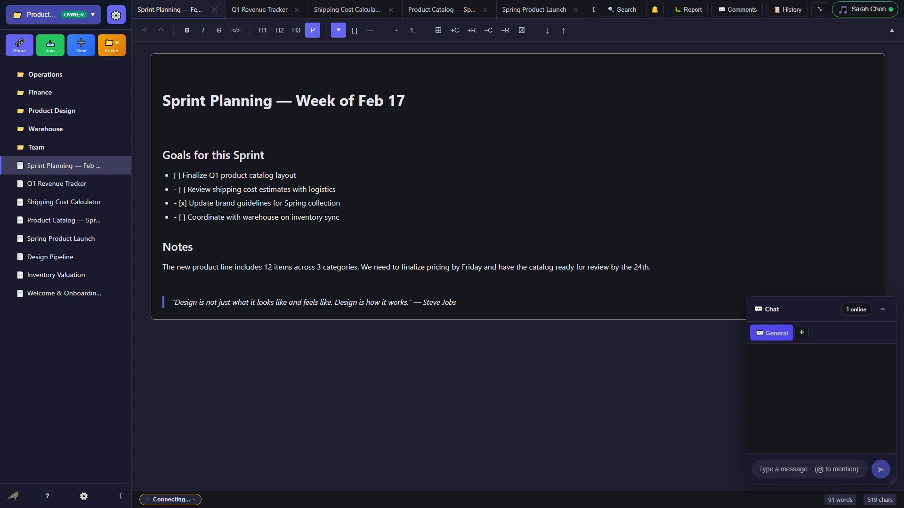
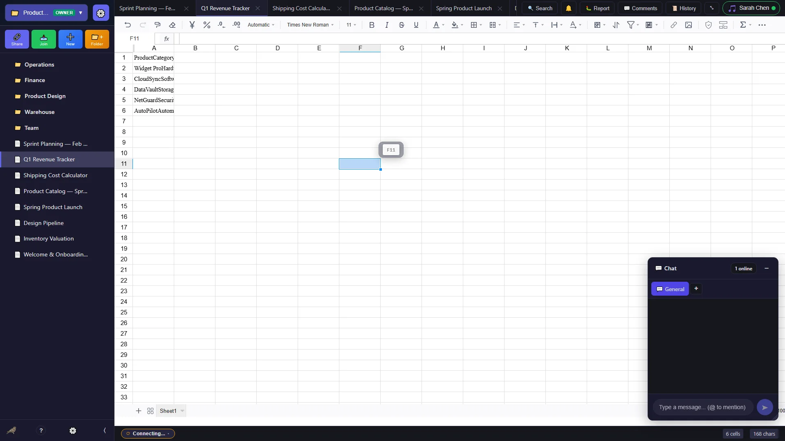
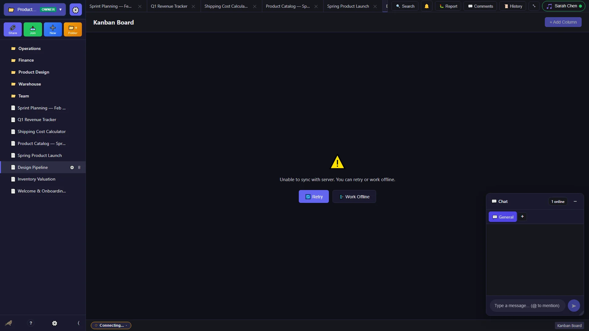
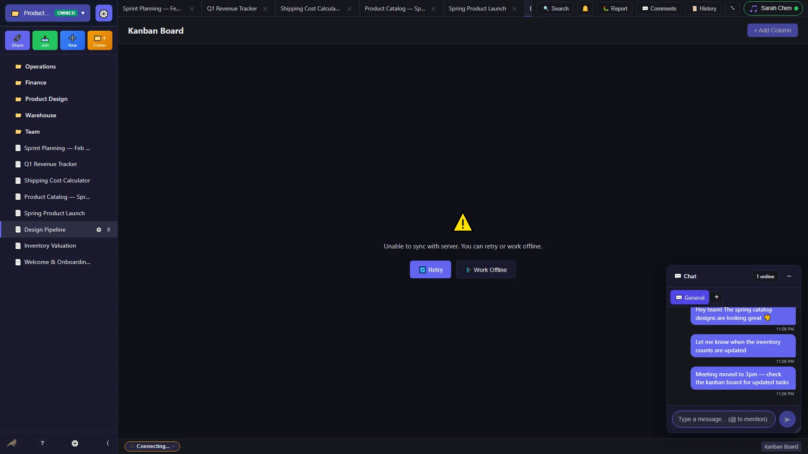
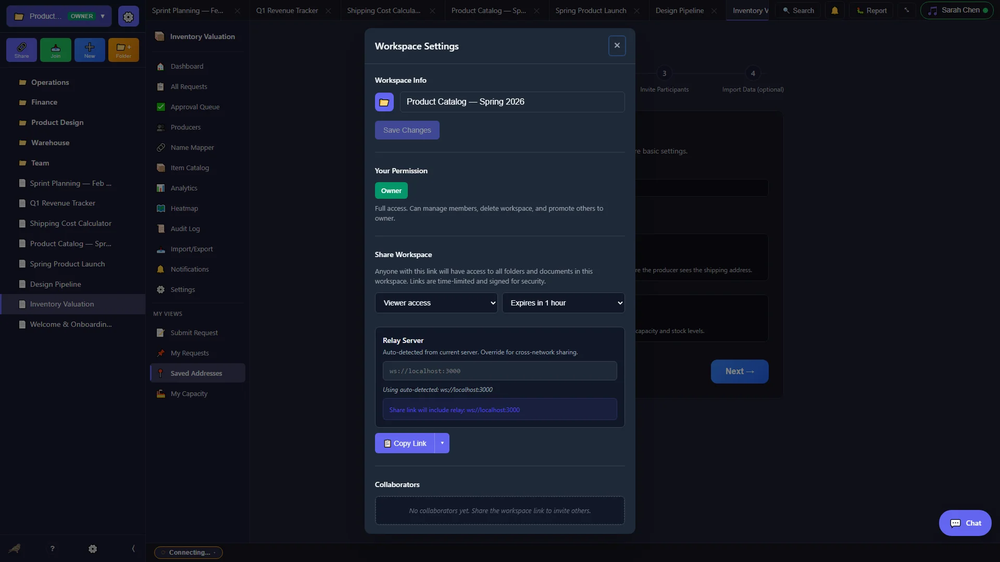

<p align="center">
  
</p>

<h1 align="center">Nightjar</h1>

<p align="center">
  <strong>Private, Peer-to-Peer Collaborative Editing</strong>
</p>

<p align="center">
  <a href="#why-nightjar">Why Nightjar</a> •
  <a href="#features">Features</a> •
  <a href="#download">Download</a> •
  <a href="#security">Security</a> •
  <a href="#architecture">Architecture</a> •
  <a href="#global-relay-mesh-network">Relay Mesh</a> •
  <a href="#docker-deployment">Docker</a> •
  <a href="#development">Development</a>
</p>

---

## Screenshots

<p align="center">
  <br>
  <em>Rich text editing with formatting toolbar, tables, and real-time collaboration</em>
</p>

<p align="center">
  <br>
  <em>Full-featured spreadsheets with formulas and cell formatting</em>
</p>

<p align="center">
  <br>
  <em>Visual task management with drag-and-drop cards and custom columns</em>
</p>

<details>
<summary><strong>More screenshots</strong></summary>

<p align="center">
  <br>
  <em>End-to-end encrypted team messaging</em>
</p>

<p align="center">
  <br>
  <em>Inventory tracking with search, filters, and CSV import/export</em>
</p>

<p align="center">
  <br>
  <em>Share workspaces via encrypted invite links or QR codes</em>
</p>

<p align="center">
  <br>
  <em>Encrypted file storage with drag-and-drop upload</em>
</p>

<p align="center">
  <br>
  <em>Beautiful dark theme — easy on the eyes</em>
</p>

</details>

---

## Why Nightjar?

**Your documents belong to you, not the cloud.**

Traditional collaboration tools require trusting a third party with your most sensitive information. Every document you create, every edit you make, every comment you leave—all stored on servers you don't control, accessible to companies, hackers, and governments.

Nightjar takes a different approach:

- 🔐 **End-to-End Encrypted** — Your content is encrypted before it leaves your device. Not even relay servers can read your documents.
- 🌐 **Peer-to-Peer** — Connect directly with collaborators. No central server stores your data.
- 🧅 **Tor-Ready** — Optional Tor integration for anonymous collaboration when privacy is critical.
- 💾 **Local-First** — Your documents live on your device. Work offline, sync when connected.
- 🔑 **Self-Sovereign Identity** — Your cryptographic identity is yours. Back it up with a 12-word recovery phrase.

Whether you're a journalist protecting sources, an activist organizing securely, a business handling sensitive contracts, or simply someone who believes privacy is a fundamental right—Nightjar gives you collaboration without compromise.

---

## Features

### 📝 Rich Text Editor
- Full formatting: bold, italic, underline, strikethrough, highlight
- Headings, lists, blockquotes, code blocks
- Tables with resizable columns
- **Floating selection toolbar** — bubble menu appears on text selection with formatting, link, and inline comment actions
- **Version history with rollback** — timeline slider, diff viewer, author attribution, rollback to any state, configurable retention
- **Auto-save** — debounced (1s) with duplicate-save prevention and retry on concurrent writes
- Import/export: Markdown, HTML, JSON, plain text

### 📊 Spreadsheets
- Multi-sheet workbooks with formula support
- Cell formatting and number formats
- Real-time collaborative editing
- Formula bar with live cell reference tracking

### 📋 Kanban Boards
- Visual project management with drag-and-drop cards
- Customizable columns and card details
- Real-time collaborative updates

### 📦 Inventory Management System *(New in v1.6)*
- **Multi-role workflow**: Administrators, Producers, and Requesters with role-specific dashboards
- **Request lifecycle**: Submit → Approve → Claim → Ship → Deliver with full status tracking
- **Smart assignment algorithm**: Priority queue with urgent + FIFO ordering
- **Capacity planning**: Track producer stock levels and production rates
- **Geographic visualization**: US state heatmap showing request distribution
- **CSV/XLSX import**: Smart column auto-mapping with validation preview
- **Encrypted addresses**: End-to-end encrypted shipping address handling (AES-GCM)
- **Catalog management**: Define item catalog with categories
- **Onboarding wizard**: 4-step setup — name & configure → define catalog → invite participants → import data
- **Shipping provider integration**: PirateShip, Shippo, EasyPost, USPS, UPS, FedEx with URL launchers and address formatters
- **Carrier auto-detection**: Auto-detects carrier from tracking number patterns with clickable tracking links
- **Analytics dashboard**: 15-component suite — fulfillment histograms, pipeline funnel, pivot table, US state heatmap, producer leaderboard, response time charts, status transitions, demand trends, inflow/outflow analysis, blocked request aging, units shipped by type, and summary metrics with date range and export controls
- **Audit logging**: Complete history of all inventory operations

### � File Storage & P2P Transfer *(New in v1.7)*
- **Full dashboard**: Browse, search, mesh view, recent files, favorites, trash, downloads, and audit log
- **P2P file transfer**: End-to-end encrypted chunk-based transfer with seeding, bandwidth sampling, and progress tracking
- **Bulk operations**: Multi-select, tag, move, and delete across files and folders
- **Lasso selection**: Rubber-band drag-select for file/folder cards (Ctrl+drag for additive)
- **Upload & download**: Drag-and-drop upload zones, download bars, file detail panels
- **Organization**: Folder creation, breadcrumb navigation, grid/list view toggle
- **Storage metrics**: Per-workspace storage usage with visual breakdown

### �👥 Real-Time Collaboration
- **Live cursor tracking** with collaborator names and colors
- **Author attribution** — color-coded contributor tracking with per-character authorship
- **Deterministic identity colors** — consistent avatar colors across all devices via publicKey hash
- **Document-level presence pips** showing who has each document open *(Enhanced in v1.5+)*
- **Focused state indicators** with glowing effect for active documents
- **Presence indicators** showing who's online with last-seen timestamps
- **Collaborator flyout** — click any avatar to view profile, start direct chat, or follow their cursor
- **Real-time commenting** on text selections, spreadsheet cells, and document sections
- **Built-in secure chat** with direct messaging, workspace channels, and inline markdown rendering
- **Conflict-free editing** using Yjs CRDT for automatic merge resolution
- **Permission-based access**: Owner, Editor, Viewer with granular controls
- **Member management**: Real-time member list, activity tracking, instant kick/ban
- **Workspace-wide notifications** for joins, edits, and system events

### 🔔 Notifications *(New in v1.5)*
- **Sound notifications** for messages, mentions, and workspace events
- **Do Not Disturb mode** to silence notifications when focused
- **Per-channel settings** for granular control
- **Visual indicators** with unread counts and badges

### 📁 Organization
- **Workspace switcher** with permission badges (Owner/Editor/Viewer) and quick-create
- **Hierarchical sidebar** — workspace → folder → document tree with color gradients, context menus, and inline renaming
- **Icon & color picker** — UnifiedPicker with 500+ emojis across 10 categories, bubble trigger with portal popover, category tab paging, search filtering, and 20-color palette for workspaces, folders, and documents *(Redesigned in v1.7.13)*
- **Breadcrumb navigation** — visual path with permission-aware access levels
- **Search palette** — fuzzy search across 7 categories (people, documents, folders, inventory, files, chat, content) with instant + async full-text phases
- Nested folder hierarchy with drag-and-drop reordering

### 🔗 Sharing
- **Cryptographically signed** invite links with Ed25519 signatures
- **Time-limited invitations** (maximum 24 hours, mandatory expiry on signed links)
- **Fragment-based encryption** - keys embedded in URL fragment, never sent to servers
- **DeepLinkGate** — automatic `nightjar://` protocol detection with graceful fallback to web join flow *(New in v1.7.15)*
- **Server-side invite cleanup** — two-tier automatic removal: hourly expired + nuclear 24h deletion *(New in v1.7.15)*
- **QR codes** for easy mobile sharing
- **Join-with-link modal** — paste `nightjar://` links or short codes with real-time validation and password field
- **Entity-level sharing** — share workspaces, folders, or individual documents with per-entity permission tiers
- **Granular permissions**: Owner, Editor, Viewer
- **Already-a-member detection** — friendly toast when re-joining an existing workspace *(New in v1.7.15)*
- **Instant revocation** - kick members and invalidate their access immediately
- **Workspace deletion** with secure data wiping

### 🔑 Identity & Security
- **Multiple identity management** — hold multiple cryptographic identities on one device with PIN unlock per identity
- **Identity QR transfer** — generate QR code with encrypted identity data and 4-digit PIN for device-to-device migration (5-minute expiry)
- **Encrypted backup & restore** — XSalsa20-Poly1305 encrypted identity + workspace backup files, downloadable and restorable
- **User profile** — emoji icon picker (500+ icons via UnifiedPicker), color picker, display name, recovery phrase reveal, diagnostic report copy
- **Memorable passwords** — human-friendly adjective-noun generator for workspace keys (8+ bits entropy per word)
- **Encrypted local storage** — defense-in-depth NaCl secretbox encryption for browser localStorage with session-scoped keys
- **Auto-lock timeout** — configurable idle timeout with lock screen

### ⚙️ App Settings
- **Theme**: Light, dark, and system-auto modes
- **Editor**: Font family, font size, line height, spell check, word wrap
- **Notifications**: 10 sound choices, volume slider, per-message-type toggles, Do Not Disturb
- **Privacy**: Auto-lock timeout configuration, encryption info display
- **Network**: Peer status poll interval, Tor configuration, relay toggle

### 📖 Built-in Help
- **In-app documentation** — full wiki-style overlay with sidebar table of contents
- **Deep-linkable sections** covering getting started, identity, workspaces, documents, sharing, collaboration, chat, file storage, inventory, keyboard shortcuts, and troubleshooting

### 🐛 Bug Reporting
- **One-click bug reports** — creates GitHub issues automatically via API
- **Auto-populated context** — title from active document/workspace, last 20 UI actions, inline diagnostic data
- **Screenshot capture** — captures app state with download button on success screen
- **Privacy-aware logging** — auto-strips PII (emails, IPs, names) before capture; separate secure logger redacts keys/secrets

### 🛡️ Error Handling
- **Global error boundary** — catches React rendering crashes with user-friendly error screen, "Copy Diagnostics" button, and reload/reset options
- **Automatic data migration** — schema migration from flat format to workspace-based format with key re-derivation
- **Toast notifications** — ephemeral success/error/info messages across all components
- **Keyboard accessibility** — focus trap across all modals (Tab/Shift+Tab cycling, Escape to close)

### 🐦 Nightjar Mascot
- Animated bird companion with random sayings in speech bubbles
- Large mode for empty states (auto-rotating), mini mode next to settings icon
- Click to advance, click-and-hold to pause

### 📊 Status Bar *(Redesigned in v1.7.8)*
- **Unified SyncChip** — single clickable button showing connection dot, peer count, sync badge (✓/⚠/⟳), relay (📡) and Tor (🧅) indicators
- **Network Popover** — expandable panel with connection details, sync verification status, Tor toggle, and action buttons (Relay Settings, Retry, Verify Sync, Force Full Sync)
- Word/character/cell counts and collaborator avatars with click-to-chat flyout
- Accessible: `role="status"`, `aria-live="polite"`, keyboard navigable

### 🌐 Privacy & Networking
- Tor hidden service support (Electron)
- Act as a relay for other peers
- Local network discovery via mDNS
- Works offline with automatic sync
- **Peer status monitoring** with connection health indicators *(v1.4+)*

### 📱 Mobile & PWA *(New in v1.7.14)*
- **Progressive Web App** — installable from mobile browser with `display: standalone`, themed splash screen, and home screen icons
- **Responsive card views** — admin tables transform into touch-friendly card lists on mobile viewports (≤768px)
- **iOS zoom prevention** — 16px input font-size, `touch-action: manipulation`, transparent tap highlight
- **Momentum scrolling** — `-webkit-overflow-scrolling: touch` on all scrollable panels
- **Four-tier breakpoint system** — phone (≤480px), tablet portrait (≤768px), tablet landscape (≤1024px), small desktop (≤1280px) across 50+ CSS files
- **Touch-friendly targets** — minimum 44px tap targets, hover guard for touch devices

---

## Download

Download the latest version for your platform:

| Platform | Download |
|----------|----------|
| **Windows** | [Nightjar Setup.exe](https://github.com/niyanagi/nightjar/releases/latest) |
| **macOS** | [Nightjar.dmg](https://github.com/niyanagi/nightjar/releases/latest) |
| **Linux** | [Nightjar.AppImage](https://github.com/niyanagi/nightjar/releases/latest) |

**Requirements:** Windows 10+ / macOS 10.15+ / Ubuntu 20.04+, 4GB RAM, 200MB disk

---

## Quick Start

1. **Download and install** Nightjar for your platform
2. **Choose your path**:
   - **New User**: Create fresh identity with 12-word recovery phrase
   - **Existing User**: Enter your recovery phrase to unlock/restore identity
3. **Save your recovery phrase** — Required for every session, keep it secure
4. **Create a workspace** — Your private container for documents
5. **Invite collaborators** — Share cryptographically signed, time-limited links
6. **Start collaborating** — Edits sync in real-time, encrypted end-to-end

**⚠️ Important**: Nightjar requires your 12-word recovery phrase every time you start the application. This "hard security" model prevents unauthorized access to your identity files.

---

## 🌐 Relay & P2P Architecture

Nightjar uses a **zero-config hybrid P2P architecture** that combines multiple networking strategies:

- **Electron clients:** Direct P2P via Hyperswarm DHT (no relay needed)
- **Browser clients:** Auto-detect relay from hosting server origin
- **Cross-platform:** Electron users can host relays via UPnP for browser peers

**No central server required** — workspaces are fully peer-to-peer with optional relays for browser clients.

### How It Works

1. **Browser-to-Browser:** Uses WebSocket relay (auto-detected from `window.location.origin`)
2. **Electron-to-Electron:** Direct P2P via Hyperswarm DHT (truly decentralized)
3. **Browser-to-Electron:** Electron embeds relay server, bridges to Hyperswarm mesh

### Custom Relay Configuration

For cross-network scenarios or private deployments, you can specify a custom relay server in Workspace Settings. The built-in validator tests connectivity and latency before use.

📖 **Learn more:**
- [Relay Architecture](docs/architecture/RELAY_ARCHITECTURE.md) - How P2P discovery works
- [Deploy Custom Relay](docs/guides/RELAY_DEPLOYMENT.md) - Host your own relay server (Fly.io, Railway, Render, or self-hosted)

---

## Security

Nightjar is built with security as the foundation, not an afterthought.

### Onboarding Security Model

Nightjar implements a **"hard cutover"** security model that prioritizes data protection over convenience:

**New User Onboarding:**
1. Generate cryptographically random 12-word BIP39 recovery phrase
2. Create Ed25519 identity keypair from phrase
3. Encrypt identity with machine-specific key
4. Display recovery phrase with secure storage instructions

**Existing User Security Flow:**
1. **Identity Detection**: System scans for existing identity files
2. **Recovery Phrase Required**: Never auto-loads — always requires 12-word validation
3. **Cryptographic Verification**: Phrase mathematically verified against stored identity
4. **Three Possible Outcomes**:
   - ✅ **Unlock**: Phrase matches → restore access to existing workspaces
   - 🔄 **Restore**: Phrase doesn't match → create new identity file (may need re-invites)
   - 🗑️ **Delete & Create**: Explicitly delete existing data → fresh start

**Why "Hard Security"?**
- Prevents malware from auto-accessing identity files
- Stops unauthorized users on shared computers
- Ensures only recovery phrase holders can access data
- Forces explicit choice when identity conflicts occur

**Data Protection Warnings:**
- **Deletion is permanent** — explicit confirmation required
- **Recovery phrases cannot be retrieved** — must be stored securely
- **Lost phrases mean lost access** — no account recovery system

### Cryptographic Primitives

| Component | Algorithm | Details |
|-----------|-----------|---------|
| **Identity Keys** | Ed25519 | Signing keypairs for authentication |
| **Encryption** | XSalsa20-Poly1305 | Authenticated encryption (NaCl) |
| **Key Derivation** | Argon2id | Memory-hard KDF (64MB, 4 iterations) |
| **Recovery Phrase** | BIP39 | 12-word mnemonic (128-bit entropy) |
| **Scoped Encryption** | Curve25519 | ed2curve-derived encryption-only keys (inventory subsystem isolation) |

### How Your Data is Protected

1. **Hierarchical Key Derivation** — Workspace password → Workspace key → Folder key → Document key
2. **Zero-Knowledge Sharing** — Share links contain the encryption key in the URL fragment (never sent to servers)
3. **Traffic Analysis Resistance** — All encrypted payloads padded to 4KB blocks
4. **Signed Invitations** — Invite links are Ed25519-signed with configurable expiry

### Privacy Features

- **No accounts** — Your identity is a keypair you control
- **No tracking** — No analytics, no telemetry, no phone home
- **No cloud storage** — Documents exist only on participants' devices
- **Tor support** — Route all traffic through Tor for anonymity
- **Hard identity security** — Recovery phrases required for every session
- **Fragment-based sharing** — Encryption keys never sent to servers
- **Time-limited access** — All invitations expire automatically
- **Secure deletion** — Cryptographic key destruction makes data unrecoverable
- **Local-first architecture** — Works completely offline

### Workspace Permission System

**Permission Levels:**

| Role | Create | Edit | Comment | Invite | Manage Members | Delete Workspace |
|------|--------|------|---------|--------|----------------|------------------|
| **Owner** | ✅ | ✅ | ✅ | ✅ | ✅ | ✅ |
| **Editor** | ✅ | ✅ | ✅ | ❌ | ❌ | ❌ |
| **Viewer** | ❌ | ❌ | ✅ | ❌ | ❌ | ❌ |

**Owner Capabilities:**
- **Full workspace control** - create, edit, delete everything
- **Member management** - invite, kick, change permissions
- **Workspace deletion** - permanent removal with secure data wiping
- **Permission changes** - promote/demote other members
- **Invite link generation** - create time-limited, signed invitations

**Editor Capabilities:**
- **Content creation/editing** - full access to documents and folders
- **Real-time collaboration** - cursors, comments, chat participation
- **Document management** - create, rename, move, delete documents
- **Cannot invite others** - prevents unauthorized workspace expansion

**Viewer Capabilities:**
- **Read-only access** - view all content without editing
- **Comment participation** - join discussions and leave feedback
- **Real-time presence** - see others and be seen
- **Export/download** - save copies for offline viewing

**Security Properties:**
- **Cryptographic enforcement** - permissions validated with Ed25519 signatures
- **Real-time updates** - permission changes apply instantly
- **Audit trail** - all permission changes logged with timestamps
- **Revocation resilience** - kicked members cannot rejoin without new invitation

### What Nightjar Does NOT Protect Against

**Device-Level Threats:**
- **Malware/keyloggers** on your device can steal recovery phrases as you type
- **Screen recording software** can capture document content
- **Physical device access** without proper screen locks or disk encryption
- **Malicious browser extensions** in browser-based deployments

**Social Engineering:**
- **Recovery phrase theft** through phishing or social manipulation
- **Malicious invitations** - users choosing to invite attackers
- **Insider threats** - authorized collaborators acting maliciously
- **Impersonation attacks** outside the Nightjar system

**Advanced Attacks:**
- **Nation-state attackers** with unlimited resources and zero-day exploits
- **Supply chain compromise** of Nightjar itself (mitigated by hard identity security)
- **Quantum computer attacks** against Ed25519/XSalsa20 (future threat)
- **Side-channel attacks** on specialized hardware (timing, power analysis)

**Technical Limitations:**
- **Copy/paste/screenshot** by authorized users
- **Network metadata analysis** without Tor (who connects when, from where)
- **Traffic correlation** with sufficient monitoring resources
- **Endpoint compromise** - if your device is fully compromised, all bets are off

**Nightjar's security model assumes:**
1. Your device is reasonably secure (updated OS, antivirus, etc.)
2. You keep your recovery phrase secret and secure
3. You only invite trustworthy collaborators
4. You're not targeted by nation-state adversaries with unlimited resources

For maximum security: Use Tor, secure your devices, store recovery phrases offline, and practice good operational security.

---

## Architecture

Nightjar uses an **Electron + Sidecar** architecture that separates the UI from heavy networking operations for security and stability.

### System Overview

> 📐 **Interactive diagrams**: See the [Architecture Deep Dive](https://night-jar.co/docs/architecture.html) for Mermaid diagrams of every layer.

```
┌─────────────────────────────────────────────────────────────────────┐
│                         NIGHTJAR CLIENT                              │
├─────────────────────────────────────────────────────────────────────┤
│                          Application Layer                           │
│  ┌─────────────┐  ┌──────────────────┐  ┌────────────────────────┐  │
│  │  React UI   │  │  TipTap Editor   │  │   Workspace Manager    │  │
│  │             │  │  Fortune Sheet   │  │   Folder/Doc Tree      │  │
│  └─────────────┘  └──────────────────┘  └────────────────────────┘  │
├─────────────────────────────────────────────────────────────────────┤
│                          Yjs CRDT Layer                              │
│  ┌─────────────┐  ┌──────────────────┐  ┌────────────────────────┐  │
│  │   Y.Doc     │  │  Y.XmlFragment   │  │   Awareness            │  │
│  │  (document) │  │  (rich text)     │  │   (presence/cursors)   │  │
│  └─────────────┘  └──────────────────┘  └────────────────────────┘  │
├─────────────────────────────────────────────────────────────────────┤
│                        P2P Service Layer                             │
│  ┌──────────────────────────────────────────────────────────────┐   │
│  │                      PeerManager                              │   │
│  │  ┌─────────────────┐  ┌────────────────────────────────────┐ │   │
│  │  │ BootstrapManager│  │       AwarenessManager             │ │   │
│  │  │ (peer discovery)│  │       (cursor sync)                │ │   │
│  │  └─────────────────┘  └────────────────────────────────────┘ │   │
│  └──────────────────────────────────────────────────────────────┘   │
├─────────────────────────────────────────────────────────────────────┤
│                        Transport Layer                               │
│  ┌─────────────┐  ┌─────────────┐  ┌───────────┐  ┌─────────────┐   │
│  │ WebSocket   │  │  WebRTC     │  │ Hyperswarm│  │   mDNS      │   │
│  │ (relay)     │  │  (direct)   │  │   (DHT)   │  │  (LAN)      │   │
│  └─────────────┘  └─────────────┘  └───────────┘  └─────────────┘   │
├─────────────────────────────────────────────────────────────────────┤
│                        Sidecar (Node.js)                             │
│  ┌─────────────────┐  ┌─────────────────┐  ┌─────────────────────┐  │
│  │ y-websocket     │  │  LevelDB        │  │  Hyperswarm DHT     │  │
│  │ server (:8080)  │  │  Persistence    │  │  + Tor SOCKS Proxy  │  │
│  └─────────────────┘  └─────────────────┘  └─────────────────────┘  │
└─────────────────────────────────────────────────────────────────────┘

┌─────────────────────────────────────────────────────────────────────┐
│                    UNIFIED SERVER (Docker)                            │
├─────────────────────────────────────────────────────────────────────┤
│  ┌─────────────────┐  ┌─────────────────┐  ┌─────────────────────┐  │
│  │ Express + WS    │  │  y-websocket    │  │  better-sqlite3     │  │
│  │ REST + Relay    │  │  Yjs sync       │  │  Encrypted at rest  │  │
│  └─────────────────┘  └─────────────────┘  └─────────────────────┘  │
│                                                                      │
│   Modes: host (mesh + storage) │ relay (mesh only) │ private        │
│   Env:   NIGHTJAR_MODE · ENCRYPTED_PERSISTENCE · PUBLIC_URL         │
└─────────────────────────────────────────────────────────────────────┘
```

### How Clients Connect

```
   Client A                    Client B                    Client C
      │                           │                           │
      │     1. Join workspace topic (SHA256 hash)             │
      ├───────────────────────────┼───────────────────────────┤
      │                           │                           │
      │  2. DHT Discovery (Hyperswarm)                        │
      │◄─────────────────────────►│◄─────────────────────────►│
      │                           │                           │
      │  3. Exchange Ed25519-signed identity                  │
      │◄─────────────────────────►│◄─────────────────────────►│
      │                           │                           │
      │  4. Encrypted Yjs sync (XSalsa20-Poly1305)            │
      │◄═════════════════════════►│◄═════════════════════════►│
      │                           │                           │
      │  5. Awareness updates (cursors, presence)             │
      │◄─ ─ ─ ─ ─ ─ ─ ─ ─ ─ ─ ─ ─►│◄─ ─ ─ ─ ─ ─ ─ ─ ─ ─ ─ ─ ─►│
```

### Transport Priority

Nightjar automatically selects the best available transport:

| Transport | Use Case | Platforms | Priority |
|-----------|----------|-----------|----------|
| **mDNS** | Same local network | Electron | 1 (fastest) |
| **Hyperswarm** | DHT-based discovery | Electron | 2 |
| **WebRTC** | Direct browser P2P | All | 3 |
| **WebSocket** | Relay fallback | All | 4 (always available) |
| **Tor** | Anonymous routing | Electron | Optional overlay |

### Data Flow

```
User types "Hello" in document
         │
         ▼
┌─────────────────────────────┐
│  TipTap Editor captures     │
│  keystrokes, updates DOM    │
└─────────────────────────────┘
         │
         ▼
┌─────────────────────────────┐
│  Yjs applies operation to   │
│  Y.XmlFragment (CRDT)       │
└─────────────────────────────┘
         │
         ▼
┌─────────────────────────────┐
│  Encryption Layer           │
│  • Derive document key      │
│  • Pad to 4KB block         │
│  • XSalsa20-Poly1305        │
└─────────────────────────────┘
         │
         ├──────────────────────────────┐
         ▼                              ▼
┌─────────────────────┐    ┌─────────────────────┐
│  LevelDB (local)    │    │  P2P Broadcast      │
│  Encrypted storage  │    │  To all peers       │
└─────────────────────┘    └─────────────────────┘
```

### At-Rest Encryption (Server)

When `ENCRYPTED_PERSISTENCE=true`, the unified server encrypts all stored Yjs documents at rest using NaCl secretbox:

```
Client creates workspace
         │
         ▼
┌─────────────────────────────┐
│  Client derives 256-bit     │
│  workspace key (Argon2id)   │
└─────────────────────────────┘
         │
         ▼  POST /api/rooms/:room/key
┌─────────────────────────────┐
│  Server receives key over   │
│  TLS, stores in-memory only │
│  (never written to disk)    │
└─────────────────────────────┘
         │
         ▼  Yjs document update
┌─────────────────────────────┐
│  Server encrypts update     │
│  XSalsa20-Poly1305          │
│  Random 24-byte nonce       │
│  Stored: nonce ‖ ciphertext │
└─────────────────────────────┘
         │
         ▼  SQLite (better-sqlite3)
┌─────────────────────────────┐
│  Encrypted blobs in DB      │
│  Key evicted on room empty  │
│  Re-delivered on next join  │
└─────────────────────────────┘
```

**Key properties:**
- Keys live only in server memory — never persisted to disk
- Each room uses a unique encryption key
- Keys are evicted when all clients disconnect
- Clients re-deliver keys on reconnection via authenticated POST
- Without the key, stored data is indistinguishable from random bytes

---

## Global Relay Mesh Network

Nightjar includes a **distributed relay mesh network** that enables high-availability peer discovery without centralized infrastructure. Anyone can run a relay server, and all relays automatically discover each other to form a resilient, globally distributed network—similar to how BitTorrent's DHT works.

### How It Works

```
┌─────────────────────────────────────────────────────────────────────┐
│                    NIGHTJAR RELAY MESH                               │
├─────────────────────────────────────────────────────────────────────┤
│                                                                      │
│    ┌─────────┐       Hyperswarm DHT        ┌─────────┐              │
│    │ Relay A │◄────────────────────────────►│ Relay B │              │
│    │ (host)  │                              │ (relay) │              │
│    └────┬────┘                              └────┬────┘              │
│         │      Mesh Coordination Topic           │                   │
│         │◄──────────────────────────────────────►│                   │
│         │                                        │                   │
│    ┌────┴────┐                              ┌────┴────┐              │
│    │ Desktop │ ─ ─ ─ Workspace Topic ─ ─ ─ ─│ Desktop │              │
│    │ Client  │       (hashed ID)            │ Client  │              │
│    └─────────┘                              └─────────┘              │
│                                                                      │
└─────────────────────────────────────────────────────────────────────┘
```

### Privacy by Design: What Peers Share

**No personally identifiable information (PII) is ever transmitted through the mesh.** The only data shared between peers is:

| Data Shared | Purpose | Privacy |
|-------------|---------|---------|
| **Hashed Workspace Topic** | SHA256(`nightjar-workspace:` + workspaceId) | Cannot reverse to get workspace ID |
| **Connection Info** | IP:port or WebSocket URL for relay nodes | Required for network connectivity |
| **Node ID** | Random 32-byte identifier | Not linked to user identity |
| **Capabilities** | Whether node persists data, max peers | Helps clients choose relays |

**What is NOT shared:**
- ❌ Usernames or display names
- ❌ Email addresses or accounts
- ❌ Document content (always encrypted)
- ❌ Workspace names or metadata
- ❌ Recovery phrases or private keys
- ❌ Original workspace IDs (only hashed topics)

### Server Deployment Modes

Nightjar servers can run in three modes, configurable via the `NIGHTJAR_MODE` environment variable:

| Mode | Mesh Participation | Data Persistence | Use Case |
|------|-------------------|------------------|----------|
| **`host`** | ✅ Public mesh | ✅ Encrypted storage | Main server - stores encrypted workspace data |
| **`relay`** | ✅ Public mesh | ❌ None | Lightweight relay - routes connections only |
| **`private`** | ❌ Isolated | ✅ Encrypted storage | Private deployment - no public discovery |

#### Host Mode (Default)
```bash
# Full server with persistence and mesh participation
NIGHTJAR_MODE=host PUBLIC_URL=wss://your-server.com node index.js
```
- Participates in the global relay mesh
- Stores encrypted workspace data for offline sync
- Announces itself as a relay for other clients
- Best for: Primary workspace servers

#### Relay Mode
```bash
# Lightweight relay, no storage
NIGHTJAR_MODE=relay PUBLIC_URL=wss://relay.your-server.com node index.js
```
- Joins the mesh to help route connections
- Does not store any user data
- Low resource usage
- Best for: Community-contributed relay nodes

#### Private Mode
```bash
# Isolated server, no mesh
NIGHTJAR_MODE=private node index.js
```
- Full persistence and sync features
- Does **not** join the public mesh
- Not discoverable by other peers
- Best for: Enterprise/private deployments, air-gapped networks

### Desktop Client Mesh Participation

Desktop clients (Electron) participate in the mesh by default to improve peer discovery:

- **Automatic workspace announcement** — When you open a workspace, your client joins that workspace's DHT topic
- **Relay discovery** — Clients learn about available relays through the mesh
- **No relay traffic** — Desktop clients don't relay traffic for others (they're not servers)
- **Opt-out available** — Set `NIGHTJAR_MESH=false` to disable mesh participation

### Share Links with Embedded Relays

When you create a share link, Nightjar can embed known relay nodes to help recipients find peers:

```
nightjar://w/abc123#p:password&perm:e&nodes:wss%3A%2F%2Frelay1.nightjar.co,wss%3A%2F%2Frelay2.nightjar.co
```

This allows new users to bootstrap into the mesh even if they haven't discovered any relays yet.

### Running Your Own Relay

Deploy a relay server with Docker and Caddy (auto-TLS):

```bash
# Using Docker Compose (relay mode — lightweight, no persistence)
PUBLIC_URL=wss://relay.your-domain.com docker compose --profile relay up -d

# Or host mode (with encrypted persistence) — starts by default
PUBLIC_URL=wss://your-domain.com docker compose up -d
```

The default public relay is `wss://night-jar.co`. Clients will automatically connect when available, and gracefully fall back to direct Hyperswarm P2P if the relay is unreachable.

**Full step-by-step deployment guide:** [docs/guides/RELAY_DEPLOYMENT_GUIDE.md](docs/guides/RELAY_DEPLOYMENT_GUIDE.md)

See [server/unified/docker-compose.yml](server/unified/docker-compose.yml) for all deployment modes and options.

### Security Properties

| Property | Mechanism |
|----------|-----------|
| **Topic Privacy** | Workspace IDs hashed with SHA256 before DHT announcement |
| **Anti-Spoofing** | BitTorrent-style IP-bound tokens prevent fake relay announcements |
| **No Enumeration** | Cannot list workspaces or users from the mesh |
| **Relay Isolation** | Private mode servers are completely isolated from public mesh |
| **End-to-End Encryption** | All document content encrypted before relay transit |

---

## Technology Stack

### Core Technologies

| Category | Technology | Purpose |
|----------|------------|---------|
| **Runtime** | Electron 30 | Cross-platform desktop app |
| **Frontend** | React 18 | UI framework |
| **Bundler** | Vite 5 | Fast development and builds |
| **Rich Text** | TipTap / ProseMirror | Collaborative text editor |
| **Spreadsheet** | Fortune Sheet | Excel-like spreadsheets |
| **CRDT** | Yjs | Conflict-free real-time sync |
| **Visualization** | Recharts / D3.js / TopoJSON | Analytics charts, geographic heatmaps |

### Networking

| Technology | Purpose |
|------------|---------|
| **Hyperswarm** | DHT-based peer discovery (Electron) |
| **libp2p** | Modular P2P networking with GossipSub |
| **y-websocket** | Yjs WebSocket sync protocol |
| **WebRTC** | Direct browser-to-browser connections |
| **Tor** | Anonymous hidden service routing |

### Cryptography

| Library | Algorithm | Use |
|---------|-----------|-----|
| **TweetNaCl** | Ed25519 | Identity signing keys |
| **TweetNaCl** | XSalsa20-Poly1305 | Authenticated encryption |
| **hash-wasm** | Argon2id | Password-based key derivation |
| **bip39** | BIP39 | Mnemonic recovery phrases |
| **Web Crypto API** | AES-GCM | Inventory address encryption |

### Storage

| Technology | Purpose |
|------------|---------|
| **LevelDB** | Client-side encrypted document storage (sidecar) |
| **better-sqlite3** | Server-side encrypted persistence (unified server) |
| **IndexedDB** | Browser-based storage fallback |

### Testing

| Technology | Purpose |
|------------|---------|
| **Jest** | Unit and integration tests |
| **Playwright** | End-to-end browser tests |
| **React Testing Library** | Component tests |

---

## Security Deep Dive

### Identity System

Your identity is a cryptographic keypair that you fully control:

```
12-word mnemonic (BIP39)
         │
         ▼ PBKDF2-SHA512
    512-bit seed
         │
         ▼ First 32 bytes
  Ed25519 secret key ──────► Ed25519 public key
         │                          │
         ▼                          ▼
   Sign messages            Your "identity"
   Decrypt data             Share with others
```

**Identity Generation & Storage:**
- **Generation**: Cryptographically random 128-bit entropy → 12-word BIP39 mnemonic
- **Storage**: Mnemonic encrypted with machine-specific key (XSalsa20-Poly1305)
- **Backup**: Export encrypted with user password (Argon2id + XSalsa20-Poly1305)
- **Hard Security Model**: Identity files **never** auto-load - always requires recovery phrase

### Identity Recovery & Protection

Nightjar implements a **hard cutover security model** - when an existing identity is detected, the system requires explicit validation:

**Three Recovery Scenarios:**

1. **🔓 Unlock Existing Identity**
   - Existing identity file detected on system
   - Recovery phrase validates against stored identity
   - Unlocks access to existing workspaces and data
   - Preserves all workspace memberships and permissions

2. **🔄 Restore Identity from Backup**
   - Recovery phrase doesn't match local identity
   - Creates new identity file from recovery phrase
   - May need re-invitation to existing workspaces
   - Useful when moving between devices

3. **🗑️ Delete and Create New**
   - Explicit deletion of existing identity data
   - **PERMANENT DATA LOSS WARNING** displayed
   - All local workspaces and documents deleted
   - Creates fresh identity with new recovery phrase
   - Cannot be undone

**Security Properties:**
- **No Auto-Loading**: System never automatically loads identity.json
- **Recovery Phrase Required**: Every startup requires 12-word validation
- **Cryptographic Validation**: Recovery phrase mathematically verified against identity
- **Data Protection**: Prevents unauthorized access to existing identity files
- **Clear Warning System**: Explicit confirmation required for destructive actions

### Key Hierarchy

Each level in the hierarchy has its own derived key:

```
Workspace Password (user-chosen or generated)
         │
         ▼ Argon2id (64MB, 4 iterations)
   Workspace Key (256-bit)
         │
         ├────────────────────────────────────┐
         ▼                                    ▼
   Folder Key (derived)              Document Key (derived)
         │
         ▼
   Sub-document Keys
```

**Argon2id Parameters:**
- Memory: 64 MB (65,536 KB)
- Iterations: 4
- Parallelism: 4
- Output: 256 bits

This memory-hard KDF makes brute-force attacks extremely expensive.

### Encryption Details

All document content uses **XSalsa20-Poly1305** authenticated encryption:

| Property | Value |
|----------|-------|
| Cipher | XSalsa20 (stream cipher) |
| MAC | Poly1305 (authentication) |
| Key size | 256 bits |
| Nonce size | 192 bits (random per message) |
| Padding | 4KB blocks (traffic analysis resistance) |

### Share Link Security

Nightjar's invite system uses **fragment-based key transmission** with **cryptographic signatures** for enterprise-grade security:

```
nightjar://w/abc123#key=base64encryptionkey&perm=e&exp=1706745600&sig=ed25519sig
           │        │                      │      │            │
           │        │                      │      │            └─ Ed25519 signature
           │        │                      │      └─ Expiration (max 24hrs)
           │        │                      └─ Permission (e=editor,v=viewer,o=owner)
           │        └─ Workspace encryption key (never sent to servers)
           └─ Workspace ID
```

**Security Properties:**
- **URL Fragment Security**: Key never sent to servers (fragment only exists client-side)
- **Mandatory Expiry**: Signed links require an expiry field — links without expiry are rejected *(Enforced in v1.7.15)*
- **Time Expiry**: Maximum 24-hour window, configurable down to minutes
- **Cryptographic Integrity**: Ed25519 signatures prevent tampering or replay
- **Zero-Knowledge Servers**: Relay servers never see encryption keys
- **Server-Side Cleanup**: Two-tier automatic invite removal — hourly expired purge + nuclear 24h deletion *(New in v1.7.15)*
- **Instant Revocation**: Active members can be kicked, invalidating their access
- **Secure Deletion**: Complete workspace deletion with cryptographic key destruction

**Link Generation Process:**
1. Generate time-limited invitation with workspace key (mandatory expiry)
2. Sign invitation parameters with workspace owner's Ed25519 key
3. Embed key in URL fragment (invisible to servers)
4. Optionally encode as QR code for mobile sharing

**Validation Process:**
1. Extract parameters from URL fragment
2. Verify Ed25519 signature against workspace owner's public key
3. Check expiration timestamp (reject if expired or missing on signed links)
4. Grant access if signature valid and not expired

**Web Share Link Flow** *(New in v1.7.15):*
1. User clicks HTTPS share link (`https://night-jar.co/join/...`)
2. Server serves full SPA (not a redirect shim)
3. DeepLinkGate attempts to open `nightjar://` protocol for desktop app
4. If app doesn't respond within 1.5s, shows fallback with "Continue in Browser"
5. Share link persists through onboarding and PIN lock via `sessionStorage`

### Workspace Management & Member Control

**Membership Management:**
- **Real-time member list** with online status and last activity
- **Instant member removal** ("kick") with immediate access revocation
- **Permission management** - change member roles (Owner, Editor, Viewer)
- **Activity tracking** - see who made changes and when

**Workspace Deletion & Data Wiping:**
- **Complete workspace deletion** removes all local data
- **Cryptographic key destruction** makes encrypted data unrecoverable
- **Secure deletion process** overwrites storage locations
- **Member notification** when workspace is deleted by owner
- **Cannot be undone** - explicit confirmation required

**Access Revocation:**
- **Immediate effect** - kicked members lose access instantly
- **Background sync termination** - connections closed automatically
- **Re-invitation required** for kicked members to rejoin
- **Audit trail** - removal actions logged with timestamps

### Security Hardening

Built-in protections against common attacks:

| Attack | Mitigation |
|--------|------------|
| **Brute force** | Rate limiting (5 attempts/60s, 5min lockout) |
| **Identity theft** | Hard cutover model - never auto-load identity files |
| **Unauthorized access** | Recovery phrase required for every session |
| **Prototype pollution** | Safe JSON parsing with Object.create(null) |
| **Path traversal** | Path sanitization and validation |
| **SSRF** | URL validation blocking localhost/internal IPs |
| **Replay attacks** | Timestamps in signed messages |
| **Traffic analysis** | 4KB padding on all encrypted payloads |
| **Timing attacks** | Constant-time comparison for crypto operations |
| **Invite tampering** | Ed25519 signatures on all invitation links |
| **Link hijacking** | Time-limited expiry (max 24 hours) |
| **Workspace persistence** | Secure deletion with key destruction |

### Threat Model

**Nightjar protects against:**
- ✅ **Mass surveillance** - End-to-end encryption with fragment-based key distribution
- ✅ **Server compromise** - Zero-knowledge servers never see plaintext or keys
- ✅ **Network eavesdropping** - All traffic encrypted, padded to resist traffic analysis
- ✅ **Metadata correlation** - Optional Tor routing for anonymous collaboration
- ✅ **Credential theft** - No passwords; cryptographic identity with recovery phrases
- ✅ **Identity hijacking** - Hard cutover model requires recovery phrase validation
- ✅ **Unauthorized device access** - Identity files never auto-load
- ✅ **Invite link interception** - Time-limited, cryptographically signed invitations
- ✅ **Workspace persistence after removal** - Secure deletion with key destruction
- ✅ **Member privilege escalation** - Granular permissions with instant revocation
- ✅ **Replay attacks** - Timestamped, signed messages with expiry validation

**Nightjar does NOT protect against:**
- ❌ **Malware on your device** - Full system access can steal recovery phrases
- ❌ **Malicious collaborators** - Invited users can copy/screenshot content
- ❌ **Physical device access** - Screen locks and disk encryption recommended
- ❌ **Advanced persistent threats** - Nation-state actors with unlimited resources
- ❌ **Social engineering** - Users sharing recovery phrases or inviting attackers
- ❌ **Side-channel attacks** - Timing, power analysis, etc. on dedicated hardware
- ❌ **Quantum computer attacks** - Ed25519/XSalsa20 vulnerable to sufficiently large quantum computers

**Realistic Attack Scenarios:**

*🎯 Corporate Espionage*: Nightjar's zero-knowledge architecture means even if relay servers are compromised, documents remain encrypted. Time-limited invites prevent long-term unauthorized access.

*🎯 Government Surveillance*: Fragment-based key distribution means invite links can be shared through separate channels. Tor integration provides traffic anonymity.

*🎯 Insider Threats*: Granular permissions and instant member removal prevent privilege abuse. Secure workspace deletion ensures terminated employees lose access.

*🎯 Supply Chain Attack*: Hard identity security prevents automatic access even if Nightjar itself is compromised - recovery phrases still required.

---

## Docker Deployment

Nightjar provides a unified Docker image for all server modes. See the [Self-Hosting Guide](https://night-jar.co/docs/self-hosting.html) for full instructions.

### Quick Start

```bash
# Pull from GitHub Container Registry
docker pull ghcr.io/niyanagi/nightjar:latest

# Host mode (default) — mesh + encrypted persistence
docker run -d --name nightjar \
  -p 4444:4444 \
  -e NIGHTJAR_MODE=host \
  -e ENCRYPTED_PERSISTENCE=true \
  -e PUBLIC_URL=wss://your-domain.com \
  -v nightjar-data:/app/data \
  ghcr.io/niyanagi/nightjar:latest

# Relay mode — lightweight, no storage
docker run -d --name nightjar-relay \
  -p 4444:4444 \
  -e NIGHTJAR_MODE=relay \
  -e PUBLIC_URL=wss://relay.your-domain.com \
  ghcr.io/niyanagi/nightjar:latest

# Private mode — isolated, no mesh discovery
docker run -d --name nightjar-private \
  -p 4444:4444 \
  -e NIGHTJAR_MODE=private \
  -v nightjar-data:/app/data \
  ghcr.io/niyanagi/nightjar:latest
```

### Docker Compose

```bash
# Host mode (default profile)
PUBLIC_URL=wss://your-domain.com docker compose up -d

# Relay mode
PUBLIC_URL=wss://relay.your-domain.com docker compose --profile relay up -d
```

**Environment variables:** `NIGHTJAR_MODE`, `PUBLIC_URL`, `ENCRYPTED_PERSISTENCE`, `PORT` (default 4444)

See [server/unified/docker-compose.yml](server/unified/docker-compose.yml) for all options.

---

## Development

### Setup

```bash
git clone https://github.com/niyanagi/nightjar.git
cd Nightjar
npm install
npm run dev
```

### Build

```bash
npm run package:win    # Windows
npm run package:mac    # macOS
npm run package:linux  # Linux
```

### Tests

```bash
npm test                    # Unit tests (Jest)
npm run test:integration    # Integration tests
npm run test:e2e            # End-to-end tests (Playwright)
npm run test:e2e:smoke      # Quick smoke tests
```

**Test Coverage:**
- Unit tests for hooks, utilities, and components
- E2E tests for all document types (editor, spreadsheet, kanban)
- Multi-user presence and collaboration scenarios
- P2P sync and share link validation
- Inventory system workflow tests

---

## Changelog

### v1.7.19 - Share Link Host Fix & Deployment Hardening
- **Critical Fix**: Share links now use `https://night-jar.co/join/...` instead of the non-existent `https://relay.night-jar.co` subdomain — clicking share links previously showed "This site can't be reached"
- **Enhancement**: New `getShareHost()` auto-detection — web deployments automatically use their own origin for share links; self-hosted instances work without configuration
- **Infrastructure**: Nginx `/join/` location block routes share link HTTP requests to the relay server (port 3001)
- **Bug Fix**: Added missing `screenshots/` directory copy in CI/CD deploy step — screenshots were not being served on the public site
- **Bug Fix**: Cache-bust screenshot URLs with `?v={hash}` query parameter to bypass Cloudflare edge cache after image updates
- **Docs**: Added comprehensive release notes and documentation update process instructions to `CLAUDE.md`
- **Testing**: 5 new tests for `getShareHost()`, updated 21 assertions across 5 test files

### v1.7.18 - Consistent Appearance Picker
- **Bug Fix**: "Create New Item" dialog now uses the standard popout appearance picker (bubble trigger → floating popover) instead of rendering the full emoji grid + color palette inline — consistent with "Edit Document Properties" and all other picker instances
- **Cleanup**: Removed dead `compact` prop and inline rendering path from `UnifiedPicker` component (~30 lines JS, ~20 lines CSS removed)
- **Tests**: Updated 8 tests across `UnifiedPicker.test.js` and `ui-components.test.js` to verify popout behavior without compact mode

### v1.7.17 - PWA Icon Refresh
- **Enhancement**: PWA icons now show the bird on a transparent background (no dark box) so the icon looks native on mobile home screens
- **Enhancement**: Bird fills ~94% of the icon width for maximum visibility at small sizes
- **Enhancement**: Separate maskable icon (`nightjar-maskable-512.png`) with the app's dark background (#0f0f17) and safe-zone-aware sizing — OS can crop to any shape without clipping the bird
- **Enhancement**: Apple touch icon (180×180) also updated to transparent bird

### v1.7.16 - PWA Start URL Fix
- **Bug Fix**: PWA "Add to Home Screen" now opens the Nightjar app instead of the night-jar.co landing page — changed `start_url` from `"/"` to `"./"` (relative) and added `scope` property
- **Enhancement**: Dynamic manifest route on the server injects `BASE_PATH` into `start_url`, `scope`, and icon paths at runtime, ensuring the PWA always opens to the correct deployment path
- **Enhancement**: Manifest served with `no-cache` headers to prevent stale PWA configs

### v1.7.15 - Spreadsheet Sync Fix (Issue #4)
- **Critical Fix**: Spreadsheet cell edits now sync across clients — migrated real-time ops from `Y.Map.set('pendingOps', ...)` (last-writer-wins) to `Y.Array('sheet-ops')` with CRDT-ordered push/observe, eliminating silent op loss during concurrent edits
- **Critical Fix**: Remote spreadsheet data now renders correctly — added `convertCelldataToData` helper that builds a 2D data array from sparse `celldata` format before passing to Fortune Sheet, fixing the "non-empty cells: 0" bug where remote updates arrived but cells appeared blank
- **Critical Fix**: Op-based sync (`applyOp`) now short-circuits the full-sheet `setData` path when ops are successfully applied, preventing double-apply flicker and data loss
- **Bug Fix**: Protection window hardened — replaced stale-snapshot queue (`queuedLocalSaveRef`) with a `dirtyDuringProtection` flag; when the 350ms window closes, the latest **live** workbook state is saved instead of a potentially outdated snapshot
- **Bug Fix**: Legacy `pendingOps` key on `Y.Map` is automatically cleaned up on sheet initialization
- **Testing**: 18 new sync tests (celldata↔data conversion, Y.Array op ordering, concurrent edits, 3-way sync, rapid edits stress test, legacy cleanup) — all 33 sheet tests passing
- **Scope**: 3 files changed (`Sheet.jsx`, `sheet.test.js`, new `sheet-sync-fix.test.js`)

### v1.7.14 - Mobile UX Optimizations, PWA & Card View
- **New Feature**: Progressive Web App (PWA) — manifest.json, generated icons (192/512/apple-touch), `display: standalone`, theme-color, apple-mobile-web-app-capable meta tags. Users can "Add to Home Screen" on iOS and Android
- **New Feature**: Mobile card view for AllRequests — responsive card layout replaces the admin table on ≤768px viewports, with status-colored borders and SlidePanel drill-in
- **New Feature**: `useIsMobile` hook — reusable React hook for viewport-based responsive behavior with matchMedia and Safari fallback
- **Bug Fix**: Z-index stacking — SlidePanel, ProducerDashboard, and ProducerMyRequests overlays changed from hardcoded `100` to `var(--z-modal-backdrop, 900)` to prevent collision with toolbars
- **Bug Fix**: FileStorageNavRail class name mismatch — mobile styles targeted `.file-storage-nav-rail__item` (BEM) but the actual class was `.file-storage-nav-item` (flat). Fixed selector
- **Bug Fix**: InventoryNavRail — added scrollbar hiding, z-index layering, and flex-shrink:0 to prevent icon compression on narrow viewports
- **Style**: iOS zoom prevention — `touch-action: manipulation`, `-webkit-tap-highlight-color: transparent`, 16px input font on mobile, hover guard for touch devices
- **Style**: Breakpoint standardization — BulkTagDialog, CatalogManager, SubmitRequest changed from 600px to 768px
- **Style**: Momentum scrolling — `-webkit-overflow-scrolling: touch` on SlidePanel and AllRequests
- **Style**: Toast bottom offset increased 40→80px to clear mobile nav rail
- **Style**: FileStorageNavRail header/divider hidden on mobile, z-index added
- **Testing**: 56 unit tests (useIsMobile hook + comprehensive mobile suite), 8 E2E Playwright tests at mobile viewport — 24 files changed, 947 insertions, 58 deletions

### v1.7.15 - Spreadsheet Sync Fix, Share Link Overhaul & Markdown Bug Reports
- **Critical Fix**: Spreadsheet sync across clients (Issue #4) — migrated ops to Y.Array CRDT, added `convertCelldataToData`, dirty-flag protection window replaces stale-snapshot queue
- **Critical Fix**: Share links now work when clicked from web on new devices — replaced deep-link shim with SPA-serving `/join/*` route
- **New Feature**: DeepLinkGate component — detects `nightjar://` protocol support, offers fallback with "Continue in Browser", "Copy Link", "Try Again", and download options
- **New Feature**: Markdown editor for bug report description — Write/Preview tabs, `simpleMarkdown()` renderer (headings, bold, italic, code, lists), structured template, dark-themed preview
- **Security**: Mandatory expiry enforcement — signed links without expiry are now rejected
- **Security**: Two-tier server invite cleanup — hourly expired removal + nuclear 24h deletion
- **Security**: Pending share link persists through onboarding and PIN lock flows via `sessionStorage`
- **Bug Fix**: "Already a member" toast now fires correctly (was never set in `joinWorkspace` return)
- **Bug Fix**: Join button disabled for expired or invalid links with clear error message
- **Testing**: 73 new tests across 4 suites (sheet-sync-fix, share-link-security, server-invite-cleanup, deep-link-gate) — 24 files changed, ~2,540 insertions

### v1.7.14 - Mobile Optimizations, PWA & Card Views
- **New Feature**: Mobile card view for AllRequests admin table (≤768px), `useIsMobile` hook
- **PWA**: Full Progressive Web App manifest with generated icons (192, 512, apple-touch)
- **Fix**: Z-index stacking on SlidePanel, ProducerDashboard, ProducerMyRequests (100→900)
- **Fix**: Nav rail mobile bugs — InventoryNavRail scrollbar, FileStorageNavRail selector mismatch
- **Fix**: iOS auto-zoom on inputs (16px minimum font), touch-action manipulation, tap-highlight removal
- **Style**: Momentum scrolling — `-webkit-overflow-scrolling: touch` on SlidePanel and AllRequests
- **Style**: Toast bottom offset increased 40→80px to clear mobile nav rail
- **Style**: FileStorageNavRail header/divider hidden on mobile, z-index added
- **Testing**: 56 unit tests (useIsMobile hook + comprehensive mobile suite), 8 E2E Playwright tests at mobile viewport — 24 files changed, 947 insertions, 58 deletions

### v1.7.13 - Security Hardening, UnifiedPicker & Responsive Breakpoints
- **Security**: Phase 1 hardening — oracle removal, security headers, signed key delivery, encrypted workspace secrets
- **Security**: Phase 2 — HMAC room-join authentication, encrypted relay transport, security audit documentation
- **Security**: Encrypted persistence (`ENCRYPTED_PERSISTENCE`) now enabled by default on all server deployments
- **New Feature**: UnifiedPicker — 500+ emoji catalog across 10 categories with bubble trigger, portal popover, category tab paging, search filtering, and 20-color palette. Replaces `IconColorPicker` across all consumers
- **New Feature**: Comprehensive mobile-first responsive breakpoints across 40+ CSS files (phone, tablet, desktop tiers)
- **Bug Fix**: Removed 43 broken Unicode 13.0+/14.0/15.0 emojis; restored 13 corrupted emoji entries
- **Bug Fix**: Emoji grid clipping fixed (10→8 columns), popover width tuned (520→480px)
- **Bug Fix**: All inline compact pickers switched to bubble+popover pattern
- **Bug Fix**: Mascot chat bubble no longer shifts page content (absolute positioning)
- **Bug Fix**: HMAC room-auth bugs — dead variable in useWorkspaceSync, missing doc-room auth in AppNew
- **Docs**: Updated screenshots, new Security Hardening docs, security model wiki page
- **Style**: GitHub star count moved into nav button to save vertical space
- **Testing**: 141 suites, 4,413 tests — 153 files changed, 11,005 insertions, 1,662 deletions

### v1.7.12 - UI Telemetry, Bug Report Submission & Landing Page
- **New Feature**: Comprehensive UI action telemetry across 21+ components (230+ instrumented actions)
- **New Feature**: Automatic bug report submission — server-side proxy with three-tier fallback
- **New Feature**: Clickable HTTPS share links replace opaque `nightjar://` protocol links
- **New Feature**: Landing page mascot chat bubble and real app screenshots
- **Bug Fix**: GitHub nav button contrast improved to WCAG AA (11:1+)
- **Infrastructure**: App path rename `/toot` → `/app` across 9 files
- **Testing**: 66 bug report modal tests, 23 proxy tests, 38 sharing tests

### v1.7.11 - Clickable Share Links, Encrypted Persistence & Landing Page
- **New Feature**: Clickable HTTPS share links with fragment-based secret transmission
- **New Feature**: Encrypted at-rest persistence (server + client) via NaCl secretbox
- **New Feature**: Public landing page overhaul — hero, slideshow, feature cards, comparison table, docs wiki
- **New Feature**: Shared content architecture — 15 JSON content files consumed by landing page, docs wiki, and in-app help
- **Infrastructure**: VITE_GITHUB_PAT injected in all build modes for CI/CD bug report integration

### v1.7.10 - Regression Fixes: Bug Report API, Changelog Slider & Rename Double-Fire
- **Critical**: Restored GitHub API submission in BugReportModal — `createGitHubIssue()` re-added with API-first, clipboard-fallback strategy
- **Critical**: Dynamic success screen — shows "Bug report submitted!" when API succeeds, "Bug report copied!" on clipboard fallback
- **UI Fix**: Changelog timeline slider labels swapped — "Newest" now correctly on left (index 0), "Oldest" on right
- **UI Fix**: Rename double-fire fixed — Enter key now calls `blur()` instead of `onRenameSubmit()` directly, preventing duplicate invocation
- **React Fix**: IdentitySelector `useEffect` moved above early return to satisfy Rules of Hooks
- **Testing**: 132 suites, 3,879 tests (0 failures) — updated 23 text references across 2 test files
- **Scope**: 6 files modified (4 components, 2 test files)

### v1.7.9 - 30-Iteration Security & Reliability Audit (165+ Bug Fixes)
- **Critical**: IPC sender validation on 15+ Electron handlers — prevents malicious renderer exploitation
- **Critical**: Machine key salt fixed — per-installation random salt was silently falling back to deterministic derivation
- **Critical**: Folder/document share link key derivation — was calling `deriveWorkspaceKey()` instead of entity-specific functions
- **Critical**: Encryption without key now throws — `encryptData()`/`decryptData()` no longer silently return plaintext
- **Critical**: Windows sidecar graceful shutdown — WebSocket shutdown message + 10s grace before force-kill (prevents DB corruption)
- **Critical**: Preload script injection hardened — full escape of backticks, template literals, and newlines
- **Security**: Server DoS protection — room limits (10K), message size limits, per-peer topic limits, rate limiting
- **Security**: Prototype pollution prevention — key allowlists on `Object.assign` from untrusted peer data
- **Security**: CSS injection blocked — peer color values now validated with `sanitizeColor()` before CSS interpolation
- **Security**: Private key file permissions — now `0o600` on Unix (was world-readable)
- **Security**: Random 16-byte salt for backup encryption (was hardcoded string)
- **Security**: Password generator entropy — removed 4 duplicate nouns reducing effective entropy
- **Security**: Never-expiring invites fixed — `expiresIn` now validated as number before arithmetic
- **P2P Fix**: Workspace switch race condition — monotonic counter prevents async leave from corrupting concurrent join
- **P2P Fix**: Unbounded Y.Doc creation — MAX_DOCS=500 limit prevents memory exhaustion from malicious peers
- **P2P Fix**: Awareness throttle double-fire — proper timestamp tracking prevents duplicate broadcasts
- **P2P Fix**: Collaborator ID stability — uses `publicKey` instead of ephemeral `clientId` to prevent duplicates
- **P2P Fix**: Ghost peer cleanup — signaling server checks limits before adding peers to rooms
- **Data Fix**: Sheet double-apply — ops tracked by clientId, local ops filtered in Yjs observer
- **Data Fix**: KanbanBoard stale state — CRUD reads from Yjs ref instead of stale React state
- **Data Fix**: Chunk availability now merges holders instead of overwriting
- **Data Fix**: Redundant Yjs writes eliminated in collaboratorSync (skip when status unchanged)
- **UI Fix**: Rename double-fire — Enter key now calls `blur()` instead of handler directly
- **UI Fix**: Presence flicker — awareness cleanup moved to unmount-only effect
- **UI Fix**: Rollback button hidden when no state snapshot available
- **UI Fix**: Changelog slider bounds clamped to prevent out-of-bounds access
- **UI Fix**: Ordered list double-wrapping in markdown export fixed
- **Memory**: AwarenessManager listener cleanup, mDNS guard, WebSocket dedup, FolderContext dead code removal
- **Reliability**: Sidecar timer cleanup on shutdown, workspace leave/delete cleans all P2P state maps
- **Reliability**: LevelDB safe iteration (collect-then-delete), IndexedDB onblocked handler, formatTimestamp NaN guards
- **Infrastructure**: Health endpoint stripped of sensitive data, Hyperswarm topic validation (64 hex chars)
- **Testing**: 132 suites, 3,876 tests (0 failures) — 12 test files updated for new behavior
- **Scope**: 120+ files modified, ~259 bugs found, ~165 fixed across Electron, sidecar, P2P, React, server, and crypto layers

### v1.7.8 - Sync Root Cause Fix, Unified StatusBar & Analytics Enhancement
- **Critical Fix**: Files not appearing without Force Full Sync — peer-identity handler now sends sync-request for ALL shared workspace topics (DHT-discovered peers were previously skipped)
- **Critical Fix**: "Verifying…" stuck forever — added 30s safety timeout in both sidecar and frontend; transitions to `failed` if no peer responds
- **Critical Fix**: Relay bridge infinite reconnect loop — fixed backoff counter never incrementing, added `BACKOFF_MAX_RETRIES = 15` cap, changed guards to use `relayBridgeEnabled` flag
- **Bug Fix**: PAT missing in bug reports — `vite.config.js` now uses `loadEnv()` to correctly read `.env` files at build time
- **Bug Fix**: Invisible pie chart buttons on analytics — added explicit CSS for `.id-view-toggle` button variants
- **Bug Fix**: "Chart library not available" on Mesh bandwidth — replaced CommonJS `require('recharts')` with ES import
- **Enhancement**: Unified StatusBar SyncChip — replaced 4 separate indicators with single chip + expandable network popover (connection, sync, Tor toggle, actions)
- **Enhancement**: Per-stage cumulative inflow chart — pipeline stage lines, per-item quantity lines, interactive toggleable legend
- **Performance**: syncMembers debounce (100ms), crypto log downgrade (`console.debug`), awareness broadcast dedup, fallback Yjs size validation
- **Infrastructure**: Relay URL migration (`night-jar.io` → `night-jar.co`), relay bridge IPC handlers, build script `clean:release` step
- **Testing**: 132 suites, 3,876 tests (0 failures) — 67 new tests, 12 updated test files

### v1.7.7 - README Feature Audit, Release Notes & Documentation
- **Documentation**: Comprehensive README feature audit — 30+ previously undocumented features added
- **New sections**: Identity & Security, App Settings, Built-in Help, Bug Reporting, Error Handling, Mascot, Status Bar
- **Enhanced sections**: Rich Text Editor (selection toolbar, version history, auto-save), Collaboration (author attribution, flyouts), Organization (search palette, sidebar details), Sharing (join-with-link, entity-level), Inventory (onboarding wizard, shipping providers, tracking)
- **Testing**: 129 suites, 3,790 tests (0 failures)

### v1.7.5 - Analytics, History Sanitization & Account Migration
- **New Feature**: ProducerResponseTime — per-producer average claim/start/ship time bar charts
- **New Feature**: StatusTransitions — request outcome summary with delivery rate and stage timing
- **New Feature**: UnitsShippedByType — stacked bar chart of units shipped by catalog item per time bucket
- **Security**: Full git history sanitization — all 147 commits rewritten to remove prior identity references
- **Account Migration**: All references consolidated under Niyanagi identity across configs, URLs, and app IDs
- **Testing**: 125 suites, 3,630 tests (0 failures)

### v1.7.4 - Curve25519 Scoped Keys, Address Reveal Fix & GitHub Migration
- **Security**: Inventory subsystem now receives Curve25519 encryption-only key (pre-derived via ed2curve) instead of full Ed25519 signing key — prevents signing capability leakage
- **Critical Fix**: Address reveal pipeline — `publicIdentity` was missing crypto keys, causing all address encryption/decryption to silently no-op; fixed with `inventoryIdentity` extending `publicIdentity` with `curveSecretKey`
- **Account Migration**: Consolidated all references under Niyanagi identity across package.json, capacitor.config.json, main.js, README, docs, and UI
- **Testing**: 125 suites, 3,630 tests — fixed 5 test regressions (stage bar queries, privacy note text, duplicate emoji element)

### v1.7.3 - Ownership Transfer, Relay Infrastructure & Y.Map Migration
- **New Feature**: PermissionWatcher component — auto-syncs ownership transfers from Yjs to local workspace with toast notifications
- **Enhancement**: Factory reset warns when you are the sole owner of workspaces and requires typing "DELETE WORKSPACES" to proceed
- **Enhancement**: Relay bridge graceful fallback — logs warning and schedules background retry instead of stopping sync
- **Enhancement**: Tor SOCKS proxy support for relay WebSocket connections (relay-bridge.js)
- **Enhancement**: P2P bridge suspend/resume — tears down Hyperswarm UDP when Tor is active (relay-only mode) to prevent IP leakage
- **Enhancement**: Default BOOTSTRAP_NODES now includes `wss://night-jar.co`
- **Critical Fix**: `getMap('info')` → `getMap('workspaceInfo')` — fixes workspace metadata never persisting via Yjs
- **Bug Fix**: Duplicate Yjs observer guard prevents registering update observers more than once per workspace
- **Bug Fix**: Sync exchange guard prevents redundant sync-state-request messages on duplicate join-topic events
- **Infrastructure**: Signaling server hardening — peer cleanup on disconnect, room ID validation, maxPayload limits, CORS, graceful shutdown
- **Infrastructure**: Nginx + Docker Compose updates for unified server deployment
- **Docs**: Comprehensive CSS color audit (520+ hardcoded violations catalogued with fix recommendations)
- **Docs**: Relay deployment guide — VPS + Docker + Caddy step-by-step setup
- **Testing**: 5 new test suites (82 new tests), 3 updated suites — 119 suites, 3,267 tests total (0 failures)

### v1.7.0 - File Storage, P2P Transfer & Presence Fixes
- **New Feature**: Complete file storage dashboard UI overhaul (browse, search, folders, bulk ops, downloads)
- **New Feature**: Floating chat button with unread badge
- **New Feature**: Slide panel component for inventory request details
- **Critical Fix**: P2P file transfer end-to-end implementation (was a TODO stub)
- **Critical Fix**: Server relay-message/relay-broadcast handlers for cross-network delivery
- **Critical Fix**: Sidecar chunk message routing via direct-message event
- **Critical Fix**: Presence indicators one-way display (publicKey race condition)
- **Bug Fix**: Inventory shipping workflow — 5 bugs in approval/address/shipping flow
- **Bug Fix**: File size display and chunk availability holder merging
- **Testing**: 110 test suites, 2,921 tests (0 failures)

### v1.6.1 - Import & Analytics Fixes
- **Bug Fix**: CSV/XLSX date parsing — imported dates no longer show "just now" (SheetJS serial date conversion fix)
- **Bug Fix**: Analytics views now correctly display imported request data (field name normalization)
- **Bug Fix**: Fixed `formatRelativeDate` for future timestamps
- **Bug Fix**: Removed duplicate React key warning in InventoryNavRail
- **Enhancement**: Import parser preserves numeric types from SheetJS
- **Testing**: 10 new test suites, 2102 total tests across 75 suites (0 failures)

### v1.6.0 - Inventory Management System
- **New Feature**: Complete inventory management system with admin, producer, and requester roles
- **New Feature**: CSV/XLSX import with smart column mapping
- **New Feature**: Geographic visualization with US state heatmap
- **New Feature**: Encrypted address storage for secure shipping
- **Enhancement**: Document-level presence pips in sidebar
- **Enhancement**: Focused state indicators with glowing effect
- **Testing**: Comprehensive E2E test suite (40+ new tests)

### v1.5.x - Presence & Notifications
- **v1.5.13**: Multi-document presence, chat fixes, spreadsheet improvements
- **v1.5.1**: Comprehensive bug audit with 40+ fixes
- **v1.5.0**: Notification sound system with Do Not Disturb mode

### v1.4.0 - P2P Stability
- Fixed P2P sync for joined workspaces
- Added peer status monitoring with connection health indicators
- Improved cross-platform workspace sharing (Mac ↔ Windows)

### v1.3.x - Sharing & Reliability
- Dynamic sidecar port configuration
- Fixed signed invite link validation
- Improved document deduplication
- Cross-platform P2P fixes

### v1.2.0 - Relay Mesh
- Global relay mesh network
- Relay configuration UI
- Base64 encoding fixes

---

## License

ISC License

---

<p align="center">
  <strong>Privacy is not about having something to hide.<br>It's about having something to protect.</strong>
</p>
